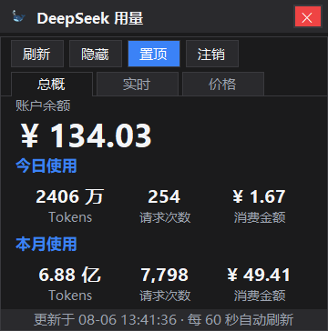
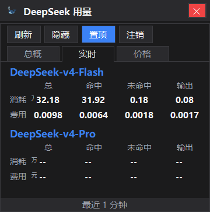
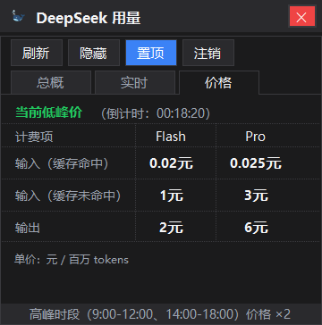

# DeepSeek 用量便签

一个 Windows 桌面小工具：藏在右下角托盘图标里，双击即可弹出/隐藏一张便签卡片，实时显示 DeepSeek 网页版账户的余额、今日使用量（Tokens / 请求次数 / 消费金额）和本月使用量。

## 功能

- 托盘常驻：双击托盘图标显示/隐藏，右键菜单支持显示、刷新、设置、退出
- 三个标签页：
  - **总概**：账户余额、今日使用、本月使用
  - **实时**：最近 1 分钟 Flash / Pro 两个模型的 Token 消耗与费用（总量 / 命中 / 未命中 / 输出）
  - **价格**：DeepSeek 峰谷计价表，实时显示当前是高峰价还是低峰价及倒计时
- 置顶开关：默认置顶，一键切换
- 登录方式：内嵌网页扫码登录，自动抓取并校验登录凭证，无需手动复制粘贴
- 数据仅保存在本机，不上传任何服务器

## 截图







## 安装

1. 到 Releases 页面下载最新版 `DeepSeekUsageTray-win-x64.exe`
2. 双击运行，首次使用会自动弹出登录窗口，用手机扫码登录 DeepSeek 网页版即可
3. 之后通过右下角托盘图标随时打开/隐藏

> 发布版本为自包含单文件，不需要安装 .NET 运行环境，Windows 10/11 直接运行。

## 从源码构建

需要 .NET 9 SDK：

```
dotnet publish -c Release -r win-x64 --self-contained true -p:PublishSingleFile=true -o release
```

## 隐私说明

- 登录凭证保存在本机 `%APPDATA%\DeepSeekUsageTray\config.json`，不会上传到任何服务器
- 展示数据来自 DeepSeek 网页版接口

## 常见问题

- **数据一直是 0 / 不刷新**：登录凭证可能已过期，点击"注销"后重新扫码登录即可
- **为什么不用 API Key**：本工具面向不想配置 API Key 的普通用户，扫码登录即可使用

## 免责声明

本工具仅供个人学习参考使用，请遵守 DeepSeek 使用条款；网页接口可能随平台改版而失效，需要时请更新工具。
